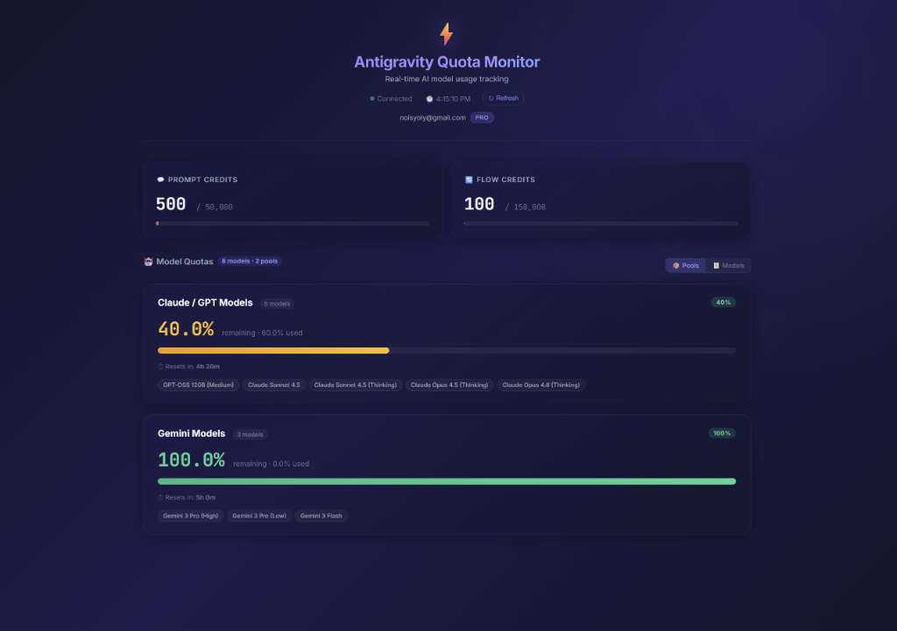
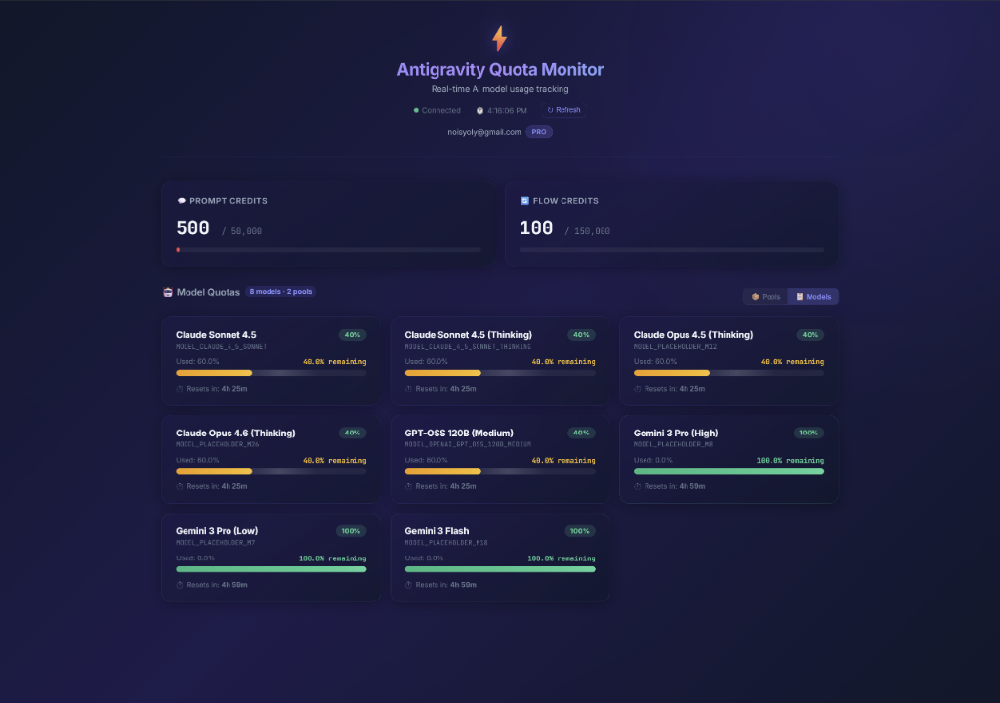

# ⚡ Antigravity Quota Monitor

A real-time web dashboard for monitoring your [Antigravity AI](https://www.antigravity.dev/) model quota usage, prompt credits, and flow credits.


## ✨ Features



- **Real-time quota tracking** — see remaining usage for all AI models at a glance
- **Quota pool grouping** — models sharing the same quota pool are grouped together, with a toggle to switch between pool and individual model views
- **Prompt & flow credits** — monitor your monthly credit consumption with visual progress bars
- **Live countdown timers** — see exactly when each quota resets
- **Auto-refresh** — data updates every 60 seconds, with a manual refresh button
- **Dark glassmorphism UI** — premium design with animated progress bars and shimmer effects

## 📋 Prerequisites

- **Python 3.9+** (tested with Python 3.13)
- **Antigravity** must be running (the Language Server process must be active)
- **Linux** (uses `pgrep` and `ss` for process detection)

## 🚀 Quick Start

```bash
# Clone or navigate to the project
cd ~/ag-quota-monitor

# Install dependencies
pip install -r requirements.txt

# Run the server
python app.py
```

Open [http://localhost:5050](http://localhost:5050) in your browser.

## 📦 Installation

```bash
# Create the project directory
mkdir -p ~/ag-quota-monitor && cd ~/ag-quota-monitor

# Install Python dependencies
pip install flask 'httpx[http2]'
```

### Dependencies

| Package | Purpose |
|---------|---------|
| `flask` | Web server and template rendering |
| `httpx[http2]` | HTTP/2 client for Language Server API communication |

> **Note:** The Antigravity Language Server requires HTTP/2 — standard Python HTTP libraries (`urllib`, `requests`) will not work.

## 🏗️ Architecture

```
ag-quota-monitor/
├── app.py                 # Flask backend — process detection, API proxy, response parsing
├── requirements.txt       # Python dependencies
├── templates/
│   └── index.html         # Dashboard UI with JS rendering logic
└── static/
    └── style.css          # Dark theme design system
```

### How It Works

```
Browser ──GET /api/quota──▶ Flask Server ──HTTP/2 POST──▶ Language Server ──▶ Google Cloud
   ◀── JSON response ────────◀── parsed quota data ──────────◀── GetUserStatus ───────◀──
```

1. **Process Detection** — finds the `language_server_linux_x64` process via `pgrep`, extracts the CSRF token and port from its command-line args
2. **Port Discovery** — uses `ss` (or `lsof` fallback) to find the process's listening ports, then tests each via HTTP/2 until a working one is found
3. **API Proxy** — sends a `GetUserStatus` request to the Language Server over HTTP/2 with the correct CSRF token
4. **Response Parsing** — extracts model quotas, prompt credits, flow credits, and groups models into shared quota pools
5. **Dashboard** — renders the data with animated progress bars, live countdown timers, and a pool/model toggle

## 🖥️ Usage

### Starting the Server

```bash
python app.py
```

The server starts on `http://localhost:5050` by default.

### Dashboard Views

| View | Description |
|------|-------------|
| **📦 Pools** | Groups models by shared quota pool — shows one card per pool with all member models listed as chips |
| **📋 Models** | Shows individual cards for every model with their own progress bar and reset timer |

Toggle between views using the buttons in the section header.

| Pools View | Models View |
|:---:|:---:|
|  |  |

### API Endpoint

```
GET /api/quota
```

Returns JSON with the following structure:

```json
{
  "plan_name": "Pro",
  "user_email": "user@example.com",
  "prompt_credits": {
    "available": 500,
    "monthly": 50000,
    "remaining_percentage": 1.0
  },
  "flow_credits": { ... },
  "models": [ ... ],
  "pools": [
    {
      "name": "Claude / GPT Models",
      "model_count": 5,
      "remaining_percentage": 60.0,
      "models": [ ... ]
    }
  ]
}
```

## 🔧 Configuration

| Setting | Default | Location |
|---------|---------|----------|
| Server port | `5050` | `app.py` line: `app.run(port=5050)` |
| Auto-refresh interval | `60s` | `index.html`: `POLL_INTERVAL` |
| API timeout | `30s` | `app.py`: `httpx.Client(timeout=30.0)` |

## ⚠️ Troubleshooting

| Issue | Solution |
|-------|----------|
| "Language Server not found" | Make sure Antigravity is running and has an active workspace |
| Slow first load (~20s) | Normal — the `GetUserStatus` API calls upstream Google Cloud services |
| Port 5050 already in use | Kill the old process: `fuser -k 5050/tcp` |
| `ModuleNotFoundError: httpx` | Install with: `pip install 'httpx[http2]'` |

## 📄 License

MIT
